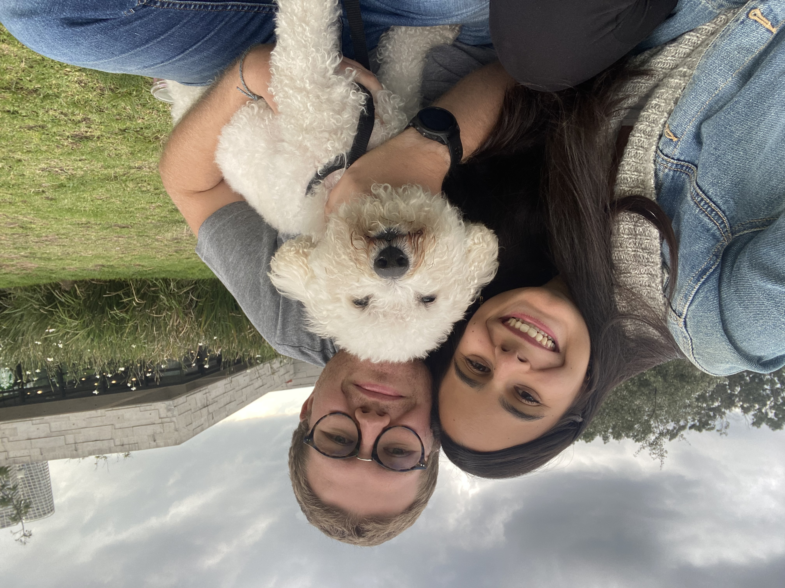

# Natasha Carpio Castellanos

## My biography 

I was born in Caracas, Venezuela on May 15, 1998. My memories about growing up in Venezuela include many
weekends by the pool where I used to enjoy the sun, laugh with my cousins and eat [**"tequeños"**](https://www.tablespoon.com/recipes/venezuelan-tequenos/340e85e0-8337-49fa-9c16-763c5634f75d), one of Venezuela's traditional food. 

After 15 years of pool, laughs and tequeños, I moved to Mexico City on 2013 due to Venezuela's political problems. It was hard adjusting at first, but I ended up settling down just fine within a couple of months. I finished my high school there, made new friends and then started my undergrad studies in Psychology at Universidad Iberoamericana Ciudad de México. I remember those 4 years with a lot of love, since I'm passionate about mental health and there I had the opportunity to learn a lot about it. 

I graduated from college at 2021 and then I took an *almost*-sabatical year where I did some freelance work, took online courses and applied to several MA programs. During that time, I met my actual boyfriend Vicente, who I have dated for a year and a half. 

Then, recently (a month ago), I moved to Chicago for Grad School at University of Chicago.

Now, I want to share a list of some of the things I love the most.

1. Water bodies such as Lake Michigan
2. Parks
3. My dog Bowser 
4. My boyfriend Vicente
5. Taylor Swift
6. Cozy pijamas
7. Hot chocolate
8. "This is us" (TV show)
9. Tacos
10. Tequeños

Last but not least, here's a picture to illustrate some of my favorite things (My boyfriend, my dog and parks)

## Reflection about the homework 

I was already familiar with the GitHub process of cloning repositories, editing files and then adding, committing and pushing. All of this I learned it during the Programming BootCamp, so it was easy to do that and it was the first thing I did. However, I didn't know how to edit a Markdown file, so I had to look for documentation online and I was able to learn the basics such as inserting images, links, using bold text, etc. I was surprised on how useful online documentations can be when they're well designed, which is something that I really appreciate as a new student on the tech field. After learning about those basics, I applied the new knowledge into editing this file to complete the assignment. 